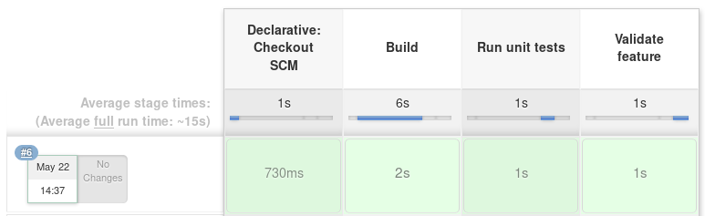

# Automatización

* Andrés Felipe Gomez Salinas
* Diego Alejandro Rodríguez Ayala
* Diego Alejandro Parra Daza

## Calculadora

Se desarrolla una calculadora de forma modular y se inicia con la modulo de suma, el cual debería sumar una lista de números, se espera poder validar de forma automática la implementación a partir de una especificación de requerimiento declarada en un script que valide lo que debe cumplir para que dicho modulo sea aceptado por el cliente.

## Herramientas

* **Jenkins** - Servidor de automatización.
* **Docker** - Herramienta de automatización de despliegue.
* **Unittest** - Librería de Python de pruebas unitarias.
* **Behave** - Librería de Python para el desarrollo impulsado por comportamiento.
* **GitHub** - Plataforma de desarrollo colaborativo.

## Pipeline (sum-feaute)

* ### Base de código remoto

  En esta etapa **Jenkins** se encarga de descargar el código fuente desde el repositorio remoto en **GitHub**, y ejecuta el script *Jenkinsfile* donde se declara el *pipeline* de automatización para dicha característica.

* ### Construcción

  En esta etapa se construye un contenedor **Docker** que instala todas las dependencias del proyecto y dispone de la versión de *Python* con la que se desarrolla el proyecto.

* ### Ejecutar pruebas unitarias

  En esta etapa se ejecutan las pruebas unitarias ya escritas, utilizando la librería **Unittest** de *Python*, en las cuales se evalúan el resultado de la suma de diferentes tipos de datos.

* ### Validar características

  Por ultimo en esta etapa se validan las características implementadas con base al script del requerimiento, utilizando la librería **Behave** de *Python*, donde se declara un escenario en el que un usuario pueda sumar dos números de cualquier tipo de dato como parámetro.
